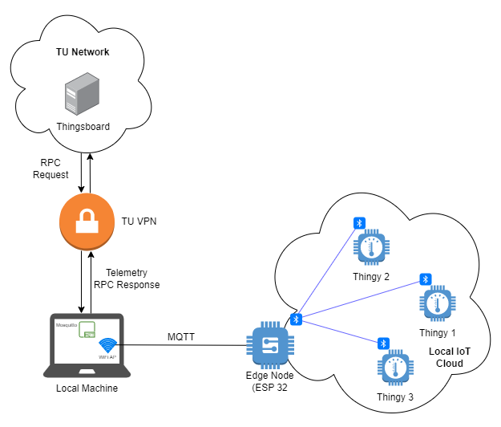
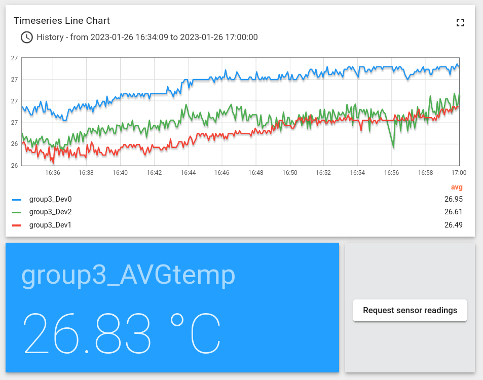

# IoT - Group 3

- Philipp Auer (01420446)
- Rafael Cristino (12202238)
- Xavier Pisco (12206635)

## Code structure

- **esp32** - Folder with the code to execute on the ESP32
- **thingy** - Folder with the code to execute on the Thingys
- **mosquitto.conf** - File with the configuration for the Mosquitto broker
- **README.md** - This file

## Dependencies

- [Mosquitto](https://mosquitto.org)
- [Arduino IDE](https://www.cc/en/software/) with the  following libraries:
    - ArduinoHTTPClient
    - ArduinoJSON
    - PubSubClient
    - [ThingsBoard](https://thingsboard.io/)

### Building the documentation

 - [pandoc](https://pandoc.org/)
 - LaTeX

`pandoc README.md -o README.pdf`

## Setup

On the ThingsBoard you should:
- Create a device which is a gateway

Before uploading the code to the ESP32 you should do these changes in the  `esp32/esp32.ino` file:
- Change the `TOKEN` variable to the access token of the device
- Change the `SERVER` variable to the IP of the computer running Mosquitto
- Change the `WIFI_AP_NAME` and `WIFI_PASSWORD` to the WIFI credentials to which the ESP32 should connect

On the mosquitto.conf you should:
- Change the `address` to the ThingsBoard address
- Change the `remote_username` to the device access token

## Running

1. Build and upload the thingy code into the 3 Thingys
1. Build and upload the esp32 code into the ESP32
1. The 3 different temperatures should appear on the `Latest Telemetry` tab in the ThingsBoard device

## Custom dasboard

We created a dashboard which shows a graph with the 3 temperatures over time.

## Request temperature

You can request an average of the 3 captured temperatures via RPC. To do so we created a button on the Dashboard. After clicking it the ESP32 will reply with an average, which is also displayed on the dashboard.

## Observed Problems

### Connecting a mosquitto broker

In order to connect the mosquitto broker to the ThingsBoard it is very important to configure the respective device as `Gateway`. Additionally the local broker has to sign into the ThingsBoard using the device access token in its `username` configuration.

Our configuration file `mosquitto.conf` is included with the code and this documentation file.

### Connecting RPC

We had a lot of issues concerning the RPC capabilities of ThingsBoard. In order to finally solve it, we needed to

 1. Connect our own mosquitto broker
 2. Subscribe the broker to the specific incoming topic that is used for RPC (`v1/devices/me/rpc/request/+`).

If the ESP is connected directly to the ThingsBoard or the broker subscribes to a wildcard topic, the service won't work and the ThingsBoard will throw a 504 Gateway Timeout error.
